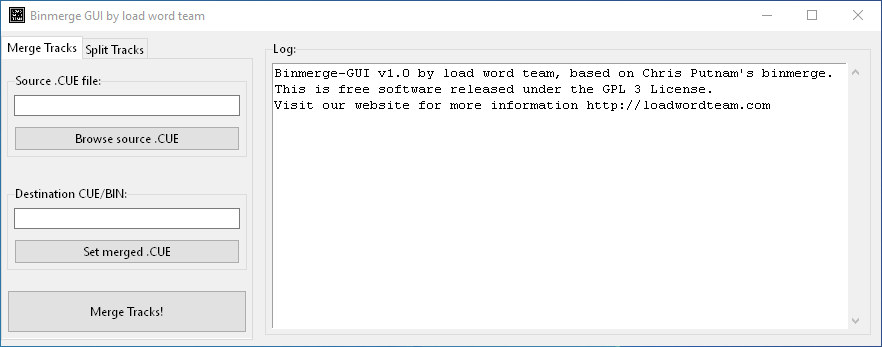

# binmerge-gui

Disc images are sometimes presented with a single .cue file followed
by multiple .bin/.wav files. While this is usually a normal feature of
disc ripping software, sometimes it can be hard to work with multiple
track files, or needlessly difficult to try to split a single-file
image.

To address some nuances on managing such images, you can use this tool
to merge different tracks into a single cue/bin file. You can also
revert the process and split the tracks.

## Contributors

- Infrid
- IlDucci

### Special thanks to

- Chris Putnam, for their original [binmerge tool](https://github.com/putnam/binmerge).
- IlDucci, for providing the idea and the necessary feedback during testing.
- Thanks to you for using this program!

## Contacts

Gianluigi "Infrid" Cusimano <infrid@infrid.com>

https://loadwordteam.com/

